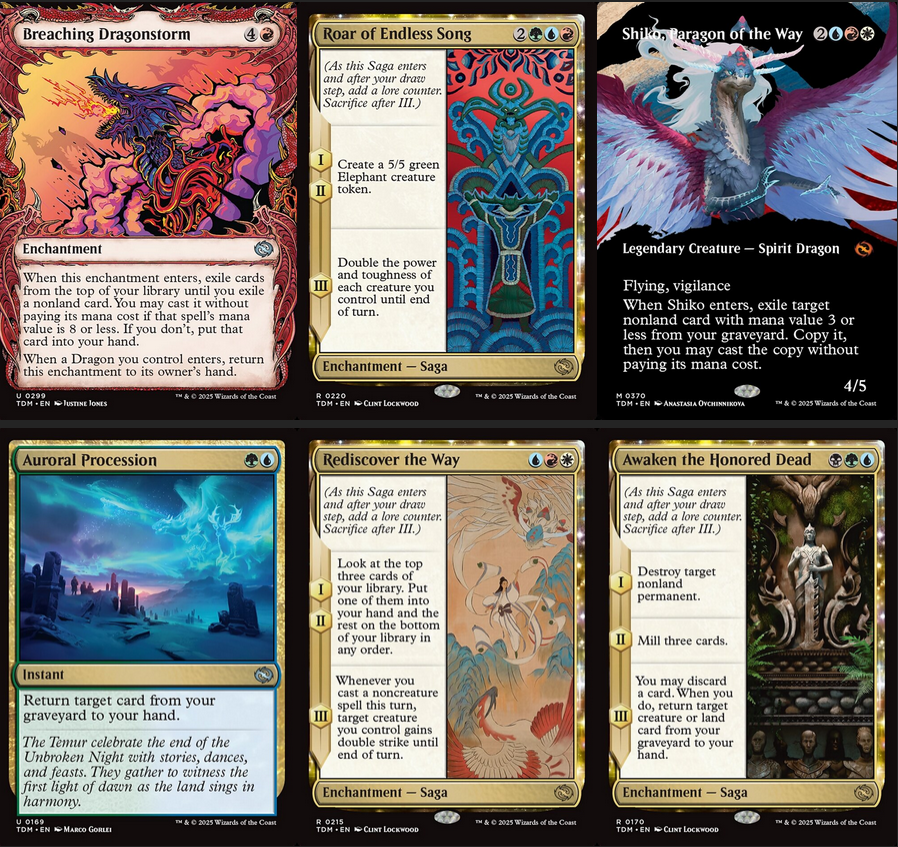
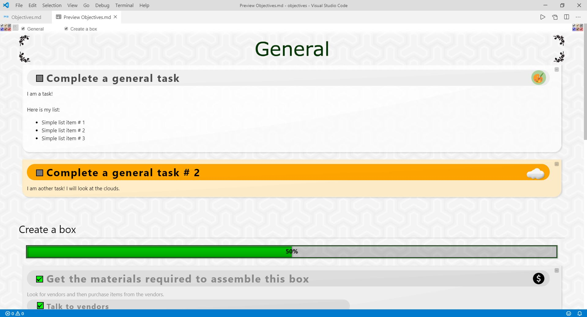
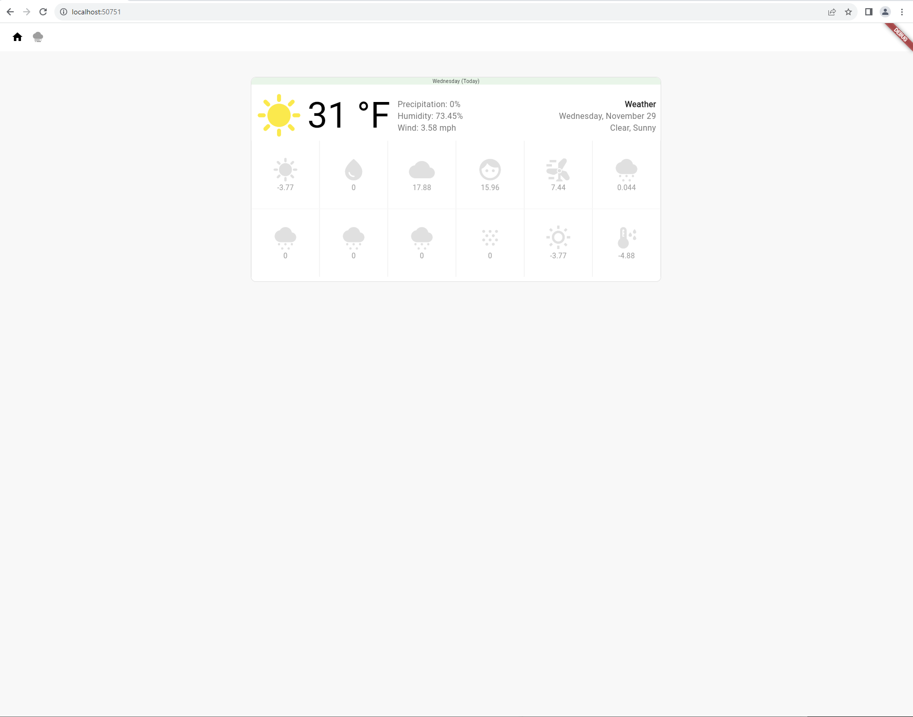

# 👋🏽 Hello world! プログラマーの宿（やど）にようこそ！

I am `Ryan` - a developer who loves working with many languages across the stack!
 

## 🌳 Regrowth - Full stack Magic: the Gathering assistant (integrates with the <a href="https://scryfall.com/docs/api" title="Scryfall API docs">Scryfall API</a>)

 

### Features: 

<ul>
  <li><b>Card Viewer</b> - View cards and make in-game decisions with a large, easy-to-view listing of your deck and each individual card.</li>
  <li><b>Search & Filter</b> - Search for cards in your deck or throughout the entire MTG card database.</li>
  <li><b>Learn</b> - Learn about new cards as they are released.</li>
  <li><b>Upcoming Features</b> - I am currently working on improving the data connection to the running game client - allowing for more features to be implemented (enemy graveyard & deck tracking based on seen cards, percentage of next draw rate, etc.)</li>
  <!-- <li><b>BOLD_NAME</b> - TEXT_DESCRIPTION</li> -->
</ul>

## 📜 Objectives.md - VSCode task manager

 

 

### Features: 

<ul>
  <li><b>Task Management</b> - Manage your tasks right in your VSCode window! Utilize VSCode / Codium's ability to preview markdown files to handle all your tasking needs.</li>
  <!-- <li><b>BOLD_NAME</b> - TEXT_DESCRIPTION</li> -->
</ul>

## ☁️ Weather Forecast App - View the latest weather forecast

 

### Features: 

<ul>
  <li><b>Weather View</b> - View today's weather and upcoming forecast!</li>
  <!-- <li><b>BOLD_NAME</b> - TEXT_DESCRIPTION</li> -->
</ul>

## 📚 Documentation for Ryan Isler (More about me):

<ul>
  <li><b>🧠 Loves learning</b> - I love to learn in not only my engineering field, but other various topics as well.</li>
  <li><b><svg role="img" style="filter: invert(48%) sepia(79%) saturate(2476%) hue-rotate(86deg) brightness(80%) contrast(119%); " viewBox="0 0 24 24" width="16" height="16" xmlns="http://www.w3.org/2000/svg"><title>Neovim</title><path d="M2.214 4.954v13.615L7.655 24V10.314L3.312 3.845 2.214 4.954zm4.999 17.98l-4.557-4.548V5.136l.59-.596 3.967 5.908v12.485zm14.573-4.457l-.862.937-4.24-6.376V0l5.068 5.092.034 13.385zM7.431.001l12.998 19.835-3.637 3.637L3.787 3.683 7.43 0z"/></svg> Neovim enthusiast</b> - In addition to VSCode / Codium, I have been enjoying using Neovim and its vast customizability.</li>
  <li><b>🎮 Game Development</b> - As a gamer, I wondered how they worked under the hood, and began creating them. (some of my favorites: Factorio, MTG, Hearthstone, Minecraft - building games are great for engineers)</li>
  <li><b>🎵 Music Composition</b> - Avid musician and composer. Family of musicians & went to <a href="https://www.pimartshs.org/" title="PiM Arts High School">Performing Arts High School</a> (I Majored in Music). Love all the sounds I can create when adding programming to the mix.</li>
  <li><b>🏠 Homelab</b> - Building up my homelab - 3D Printing, some Pi 4's for IoT stuff, NAS and a PowerEdge for some assistant-style apps on Kubernetes</li>
  <li><b>🖥️ Digital Media Enthusiast</b> - I am all things tech. While earning my Bachelor's at <a href="https://www.hamline.edu/" title="Hamline University">Hamline</a>, I created a variety of fun and creative projects for web, video, animation, sound, and more.</li>
  <li><b>🌌 Science Fiction</b> - I am a fan of the incredible sciences we do know, and that which we don't yet know. What are the limits of (quantum) technology?</li>
  <li><b>🈷️ Japanese 日本語</b> - Fan of the anime, games, and culture of Japan. Embarking on the journey of learning the language.</li>
  <li><b>🌐 AI / ML</b> - Working with deep learning to assist with projects and speed up repetitive tasks. Excited to see what the limitations of this new technology will be as models get better and better (1.76T params wow!).</li>
  <li><b>📺 Misc. Favorites</b> - Some of my favorite miscellaneous topics are: <a href="https://www.imdb.com/name/nm0634240/" title="Christopher Nolan Films">Christopher Nolan</a> films, 4D game - <a href="https://miegakure.com" title="Miegakure 見え隠れ, 4th-spatial dimensional game.">Miegakure</a>, 3 Body Problem (concept & books), Physics (how are transistors so small nowadays (WR is 1nm!!))</li>
  <!-- <li><b>BOLD_NAME</b> - TEXT_DESCRIPTION</li> -->
</ul>

## 💻 Ever-expanding list of my favorite technologies:

 

 

 

 

 

## 😎 Additional links to see what else I've been up to:

